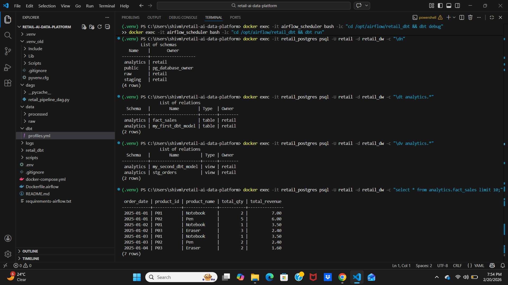
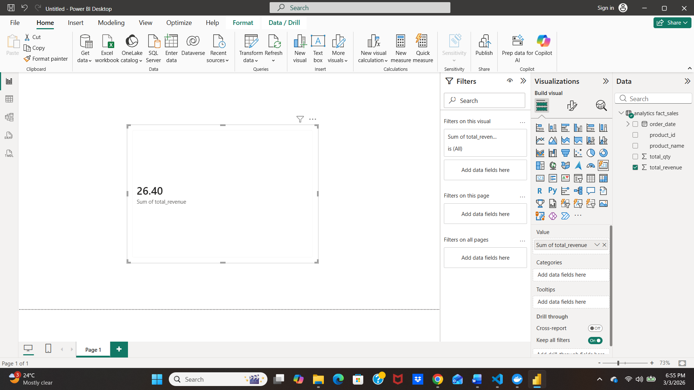
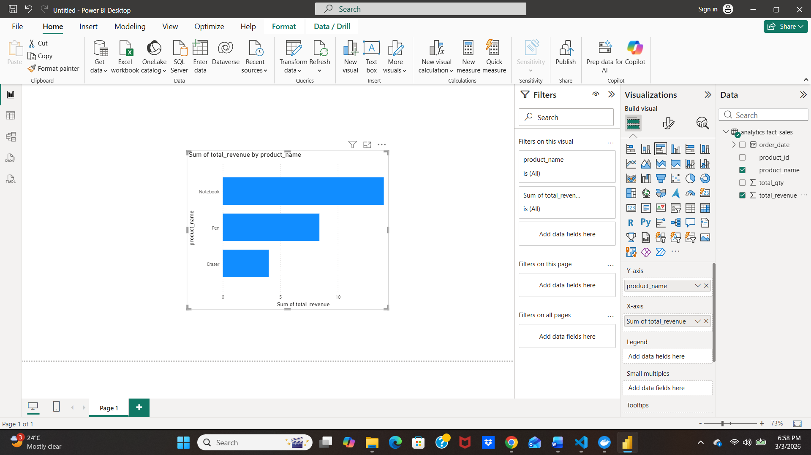
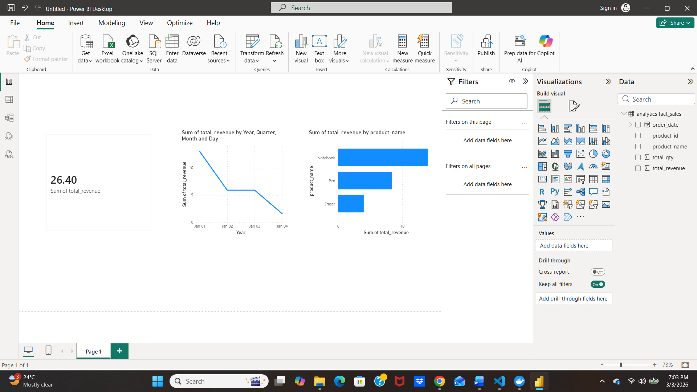

🚀 Retail Analytics Data Platform

Airflow + PostgreSQL + dbt + Docker

📌 Project Overview

This project demonstrates a complete end-to-end data engineering pipeline built using modern data stack tools.

The pipeline ingests raw retail order data from a CSV file, loads it into a PostgreSQL warehouse using a Python ETL process, transforms it into analytics-ready tables using dbt, and orchestrates everything through Apache Airflow.

The goal of this project is to simulate how production data pipelines are designed in real-world analytics teams.

🧠What Problem This Solves

Raw data is often messy and not directly usable for reporting.

This pipeline:

Ingests raw retail data

Cleans and structures the data

Builds analytics-ready models

Automatically runs the full workflow

Validates data quality

The final result is a structured fact_sales table that can be used for reporting and business insights.

🏗 Architecture Overview
CSV File (Raw Orders)
        ↓
Python ETL (Airflow Task)
        ↓
PostgreSQL (raw / staging schemas)
        ↓
dbt Transformations
        ↓
analytics.fact_sales (Final Model)
        ↓
Orchestrated by Airflow

This layered approach mirrors real-world warehouse architecture:

Raw Layer

Staging Layer

Analytics Layer

🛠 Tech Stack

Docker & Docker Compose – Containerized environment

Apache Airflow – Workflow orchestration

PostgreSQL – Data warehouse

dbt (Postgres adapter) – SQL transformations & testing

Python – ETL processing

SQL – Data modeling

📂 Project Structure
.
├── dags/                     # Airflow DAG definition
├── scripts/                  # Python ETL scripts
├── data/raw/                 # Input CSV data
├── retail_dbt/               # dbt project (models, tests)
├── screenshots/              # Execution proof images
├── docker-compose.yml
├── Dockerfile.airflow
├── README.md
⚙️ How to Run the Project Locally
1️⃣ Start Docker Containers
docker compose up -d --build
2️⃣ Open Airflow UI

URL: http://localhost:8080

Username: admin

Password: admin

3️⃣ Trigger the DAG

Run DAG: retail_pipeline

The pipeline will:

Load raw CSV data into Postgres

Run dbt transformations

Execute dbt tests

Complete successfully if all checks pass

📊 Final Output

The main analytics table produced:

analytics.fact_sales

Columns:

order_date

product_id

product_name

total_qty

total_revenue

Example query:

select * from analytics.fact_sales limit 10;

This table can be directly used for:

Revenue reporting

Product performance analysis

🤖 Revenue Forecasting (Scikit-Learn ML Model)

In addition to building analytics-ready warehouse tables, this project includes a machine learning forecasting step.

A Linear Regression model (Scikit-Learn) is trained on historical daily revenue data from analytics.fact_sales to predict future revenue.

Forecasting Process

Aggregate daily revenue from fact_sales

Create time-based numerical features

Train a Linear Regression model

Split data into training and test sets

Evaluate performance using:

MAE (Mean Absolute Error)

RMSE (Root Mean Squared Error)

Store predictions and metrics back into Postgres

Forecast Tables Created

analytics.revenue_forecast

Stores future predicted revenue values

Includes forecast date and model name

analytics.forecast_metrics

Stores model evaluation metrics

Includes MAE and RMSE values for each run

-- View latest forecast metrics
select * from analytics.forecast_metrics
order by run_ts desc
limit 5;

-- View forecasted revenue
select * from analytics.revenue_forecast
order by run_ts desc, ds
limit 10;

Daily sales trends

🧪 Data Quality Checks (dbt)

dbt is used to:

Create modular SQL models

Manage model dependencies

Run automated data tests

Validate schema consistency

This ensures transformations are reliable and production-ready.

📸 Execution Proof
Airflow DAG Success

dbt Run and Tests Passing

Final Postgres Output

## Power BI Dashboard

### Data Connection

### Total Revenue KPI

### Revenue Trend

### Top Products

### Final Dashboard

